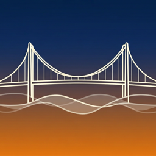

<p align="center">
  
</p>

<h1 align="center">Istanbul</h1>

<p align="center">
  Ambient soundscapes from Istanbul, right in your menu bar.<br>
  <sub>Powered by <a href="https://sound-effects.bbcrewind.co.uk">BBC Rewind Sound Effects</a></sub>
</p>

<p align="center">
  <a href="https://github.com/f/istanbul/releases/latest"></a>
  <a href="https://github.com/f/istanbul/blob/main/LICENSE"></a>
  
</p>

---

A free, open-source macOS menu bar app that plays ambient sounds recorded in Istanbul on a continuous loop. Perfect as background white noise for focus, relaxation, or a virtual trip to the Bosphorus.

## Install

**Homebrew** (recommended)

```bash
brew install f/tap/istanbul
```

**Manual download**

Download the latest **Istanbul.dmg** from [Releases](https://github.com/f/istanbul/releases), open it, and drag Istanbul to Applications. Since the app is not notarized, you may need to run:

```bash
xattr -cr /Applications/Istanbul.app
```

## Sounds

All 18 ambient recordings are sourced from the [BBC Rewind Sound Effects](https://sound-effects.bbcrewind.co.uk/search?q=istanbul) library, captured on location across Istanbul:

| Sound | Duration |
|-------|----------|
| Street atmosphere, with voices, footsteps, and traffic | 3:18 |
| Sidestreet, occasional traffic on wet road | 3:01 |
| Sidestreet, with streetsellers and distant traffic | 1:53 |
| Street music, with passing traffic and voices | 2:57 |
| Spice market, with footsteps and voices | 4:14 |
| Covered bazaar, indoor acoustic with general activity | 5:19 |
| Kadikoy market, vegetable and meat sellers | 4:25 |
| Cafe atmosphere, backgammon and conversation | 5:07 |
| Quayside at Kadikoy, fish sellers and seagulls | 3:48 |
| Shoreside atmosphere, lapping water and passing boats | 4:50 |
| Ferry, Galata Bridge to Uskudar | 7:36 |
| Ferry boarded, voices and clattering ramps | 1:28 |
| Hagia Sophia church, interior with heavy reverb | 4:38 |
| Sultan Ahmet Camii (Blue Mosque) interior | 2:23 |
| Skyline atmosphere, call to prayer, children, traffic | 1:46 |
| Outside university, peanut sellers and pigeons | 2:10 |
| Child streetseller, with voices and distant music | 1:31 |
| Traffic at busy road junction | 5:00 |

Sounds download as MP3 on first play and are cached locally for offline use.

## Features

- **Menu bar only** — no Dock icon, no floating windows, just a clean tray icon
- **One-click play** — pick a sound and it loops continuously
- **Volume control** — custom slider right in the popover
- **Offline cache** — sounds are downloaded once and stored locally
- **Lightweight** — native Swift/SwiftUI, no Electron, no runtime dependencies

## Building from Source

Requires macOS 15+ and Xcode 26+.

```bash
git clone https://github.com/f/istanbul.git
cd istanbul
open Istanbul.xcodeproj
```

Hit **Run** in Xcode, or build a universal (arm64 + x86_64) DMG:

```bash
./build.sh
```

## License & Attribution

Istanbul is open source software released under the [MIT License](LICENSE).

All ambient sounds are sourced from the [BBC Rewind Sound Effects](https://sound-effects.bbcrewind.co.uk) library and are provided under the [RemArc licence](https://sound-effects.bbcrewind.co.uk/licensing). Per the licence terms, BBC sound effects may be used for **non-commercial, personal, educational, and research purposes only**. This app is free, non-commercial, and ad-free.

> bbc.co.uk – © copyright 2026 BBC

For commercial use of BBC sound effects, see [Pro Sound Effects](https://www.prosoundeffects.com).
